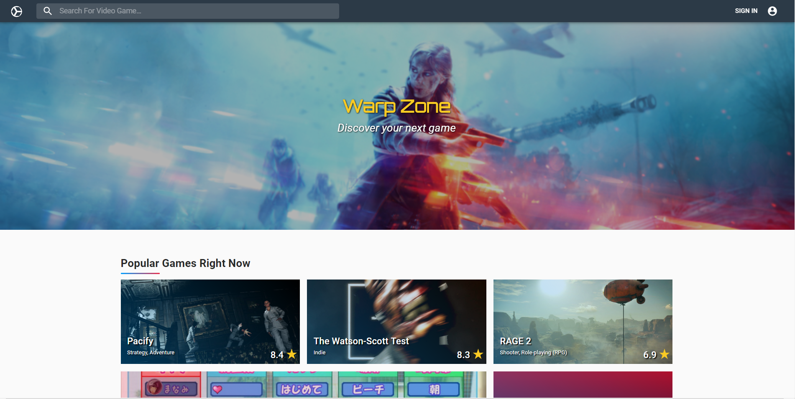
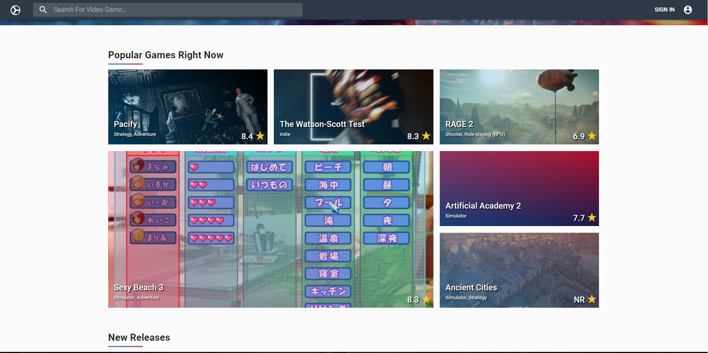
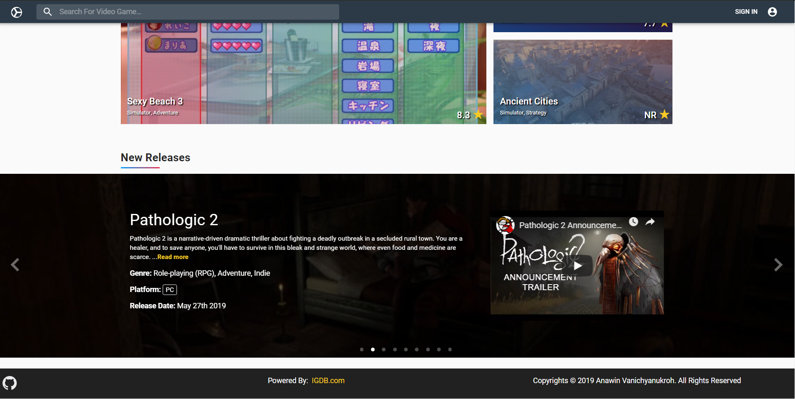
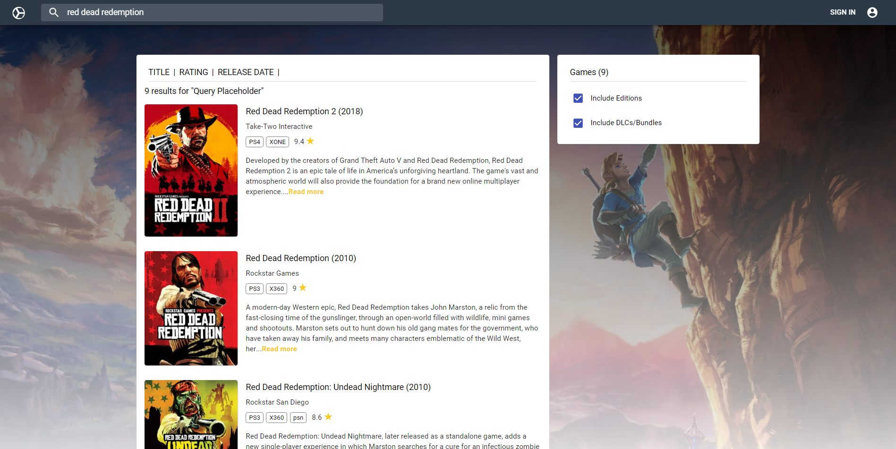
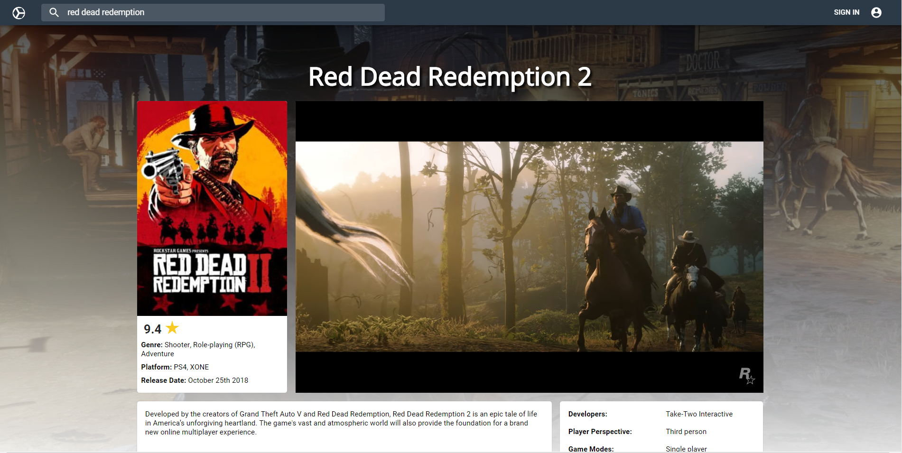
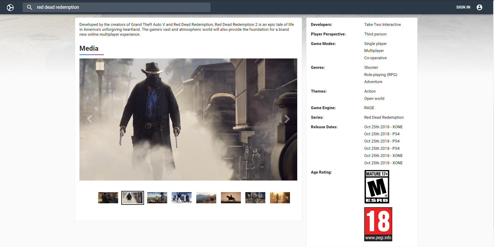
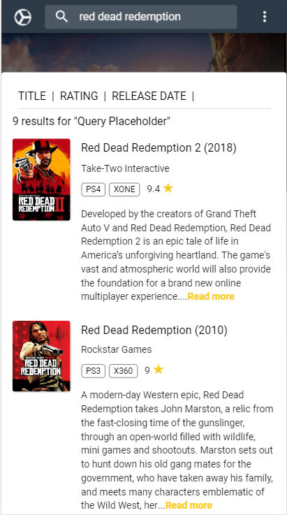

# Warp Zone 2.0

An application for users to research their next video game of interest along with their current sale prices.  

This is a ongoing rebuild of the original Warp Zone site. Checkout what features will be coming out next at [Future Implementations](#future-implementations).  

See original GitHub via the link below.  

Original Warp Zone GitHub: <https://github.com/avanichyanukroh/warp-zone>

## Motivation

Tired of playing the same game or simply just looking for a great video game to gift? It's a lot of work to keep searching different sites to figure out which video game is the right one for you or the person you are buying it for. Sometimes after you find the right one, it was just simply out of your budget range. This gave me the idea to create a simple and effortless application that combines both aspects of video game and price comparison research.

## Screenshots

Landing Page Hero Section:

Landing Page Popular Games:

Landing Page New Releases:

Search Results:

Game Profile:

Game Profile Info:

User Profile Page:

Mobile View:

## Demo

username: gamer1
password: password

Log in with a preexisting demo account listed above to try out a personal profile account.

## Built With

* HTML
* CSS
* JavaScript
* React
* Redux
* Node.js
* Mlab
* Heroku

## Features

* Search video games by title.
* Filter by title, rating, and release dates.
* Detailed video game information.
* Video game screenshots and gameplay videos.
* Popular games section.
* New releases section.

## Future implementations

* Personal and customizable user profile (From original).
* Add and delete games on/off wishlist (From original).
* Price comparison section per game profile (From original).
* Coming soon section.
* Advance searches and filters (Search by genre, platform, developers).
* Personalized landing page based off user's genre preference and platform.
* Share and collaborate between users with personal profiles.
* Price watch list.
* Game release watch list.
* Game review section.
* Relevant news in landing page and game profile page.
* More transitioning animation.

## Author

* **Anawin Vanichyanukroh** - ** - Front-End Development, Back-End Development, Testing, Styling